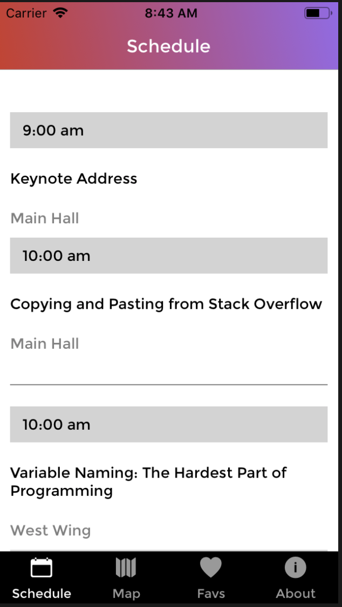
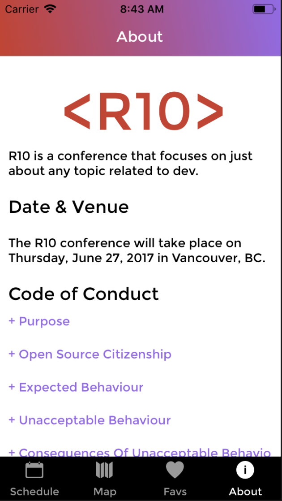

# R10 🏙

### ScreenShot

 
 
---

## Description

This is a project that displays my abilities to work with react native and creat a app that runs both on ios and android devices.

---

### Installation

Install yarn like:

```bash
yarn install
```

## Usage

### Run this:

```bash
react-native run-ios
```

### Technologies Used

- React Native
- React Native Navigation

---

## Author

- Name: Jeremiah
- My [Linkin](https://www.linkedin.com/in/jeremiah-aguirre-606708181/)

## Am I missing some essential feature?

- **Nothing is impossible!**

- Open an [issue](https://github.com/jeremiahaguirre/r10/issues/new) and let's make R10 better together!

- _Bug reports, feature requests, patches, and well-wishes are always welcome._ :heavy_exclamation_mark:
